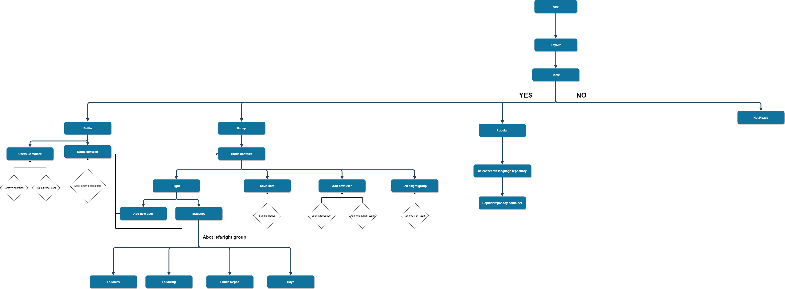

Ca puncte forte pe langa cele din cerinta standard:
  -apicatia suporta battle intre n useri.
  -Coponenta de Popular repos.
    - permite pe langa cele setate ca, constante, cautatrea repurilor favorite
  -Componenta Group:
    - suporta battle intre 2 grupuri (doar 2 grupuri deoarece am preferat sa pastrez acele grupuri pe un server).
    - sectiunea de statistici pentru cele 2 grupuri
    
    
  -Este disponibila si varianta pentru mobile.

To do:
  -drag and drop intre cele 2 grupuri
  -cautat o metoda de a evita cors
  -history meciuri
  -web sockets
  
  
  
Mai jos am adaugat o diagrama a componentelor:
  

